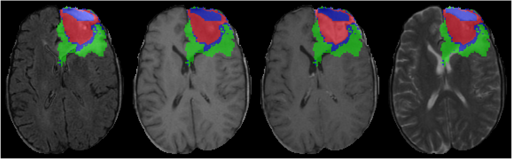

# GliMR MONAI workshop notebooks

This repository is for MONAI notebooks that will be used for the GliMR workshop.

For this workshop we will be using the [Decathlon dataset](http://medicaldecathlon.com). Particularly we will be using the Task01_BrainTumour dataset. 

For the sake of quick training, we will focus on 2D slices from this dataset, but the process would be almost identical for the full 3D data. Plenty of examples of 3D classification and segmentation can be found in the [MONAI tutorials repository](https://github.com/Project-MONAI/tutorials).

## Decathlon brain tumour dataset

- Target: Gliomas segmentation necrotic/active tumour and oedema
- Modality: Multimodal multisite MRI data (FLAIR, T1w, T1gd, T2w)
- Size: 750 3D volumes (484 Training + 266 Testing)
- Source: BRATS 2016 and 2017 datasets.
- Challenge: Complex and heterogeneously-located targets

  

## Running the notebooks

Notebooks should be able to run as-is. They start by checking that MONAI is installed, and install it if necessary (plus any extra dependencies). The notebooks should be able to run in Google Colab, which allows users to access a GPU free of charge.

The 2D dataset that has been created from the 3D one can be downloaded or generated using an included python script.

It should be possible to enable the GPU in Google Colab with: `Runtime > Change runtime type > Hardware accelerator > GPU`.

## User input

We have two versions of each notebook. One should be complete and run without any modifications. The other has gaps that asks the user to enter their own solution. The answers are hidden in a collapsible text box. Feel free to rely on these as much as necessary, but you will get the most of the experience if you think it through or search the internet prior to displaying the results.

